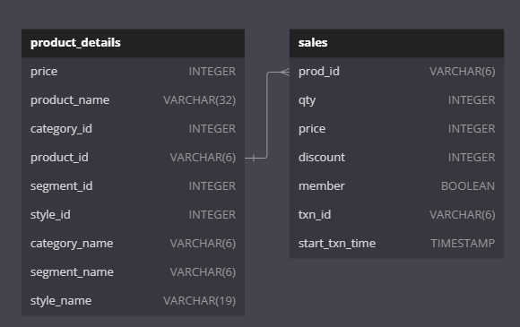
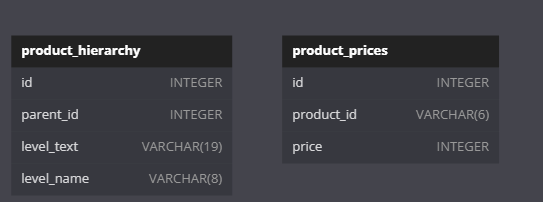

Link: https://8weeksqlchallenge.com/case-study-7/

# Case Study #7 - Balanced Tree Clothing Co.

## Introduction
Balanced Tree Clothing Company prides themselves on providing an optimised range of clothing and lifestyle wear for the modern adventurer!

Danny, the CEO of this trendy fashion company has asked you to assist the team’s merchandising teams analyse their sales performance and generate a basic financial report to share with the wider business.

## Available Data
For this case study there is a total of 4 datasets for this case study - however you will only need to utilise 2 main tables to solve all of the regular questions, and the additional 2 tables are used only for the bonus challenge question!

**Product detail** \
balanced_tree.product_details includes all information about the entire range that Balanced Clothing sells in their store.

**Sales** \
balanced_tree.sales contains product level information for all the transactions made for Balanced Tree including quantity, price, percentage discount, member status, a transaction ID and also the transaction timestamp.

**Product Hierarcy & Product Price**
These tables are used only for the bonus question where we will use them to recreate the balanced_tree.product_details table.

## Case Study Questions

### A. High Level Sales Analysis
1. What was the total quantity sold for all products?
2. What is the total generated revenue for all products before discounts?
3. What was the total discount amount for all products?

### B.Transaction Analysis
1. How many unique transactions were there?
2. What is the average unique products purchased in each transaction?
3. What are the 25th, 50th and 75th percentile values for the revenue per transaction?
4. What is the average discount value per transaction?
5. What is the percentage split of all transactions for members vs non-members?
6. What is the average revenue for member transactions and non-member transactions?

### C. Product Analysis
1.	What are the top 3 products by total revenue before discount?
2.	What is the total quantity, revenue and discount for each segment?
3.	What is the top selling product for each segment?
4.	What is the total quantity, revenue and discount for each category?
5.	What is the top selling product for each category?
6.	What is the percentage split of revenue by product for each segment?
7.	What is the percentage split of revenue by segment for each category?
8.	What is the percentage split of total revenue by category?
9.	What is the total transaction “penetration” for each product? (hint: penetration = number of transactions where at least 1 quantity of a product was purchased divided by total number of transactions)
10.	What is the most common combination of at least 1 quantity of any 3 products in a 1 single transaction?

## Solutions
For explantion check [here](https://github.com/NgocHueLy/balanced_tree_clothing/blob/main/sql_solutions.md)
\
For scripts: [here](https://github.com/NgocHueLy/balanced_tree_clothing/blob/main/sql_cs7.sql)
